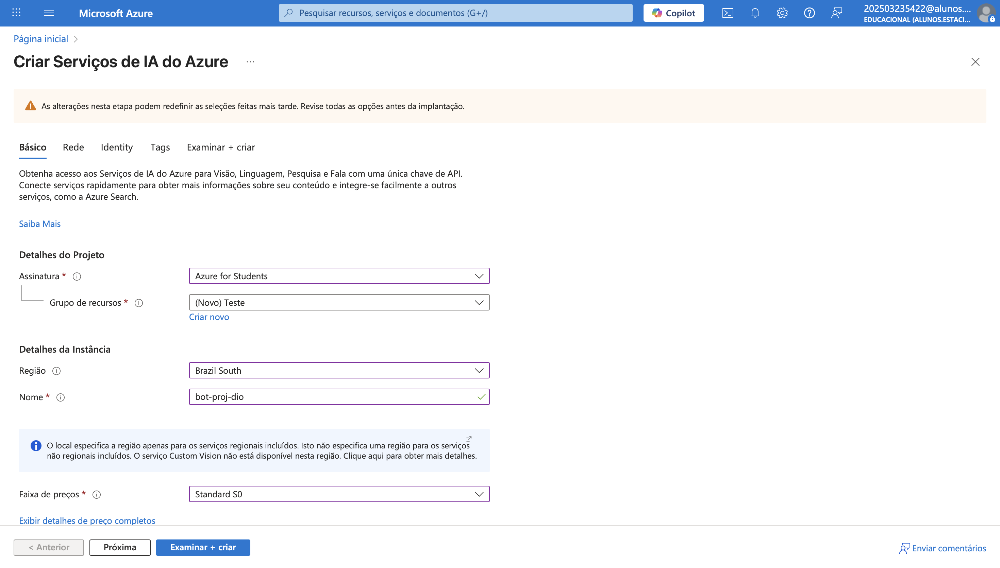
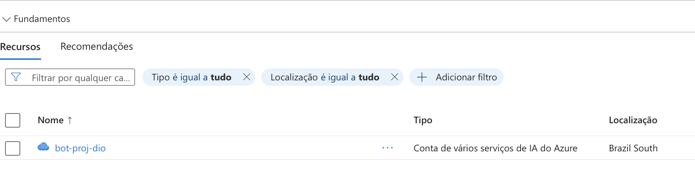
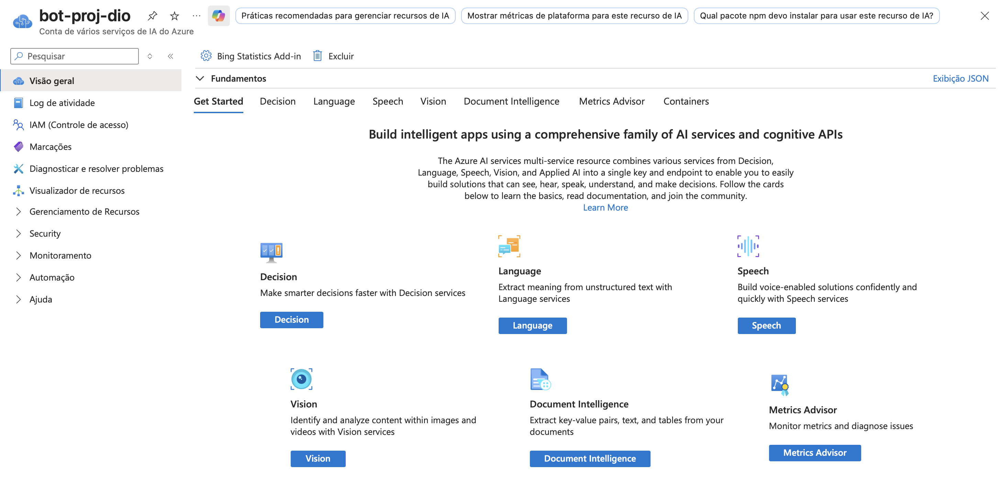
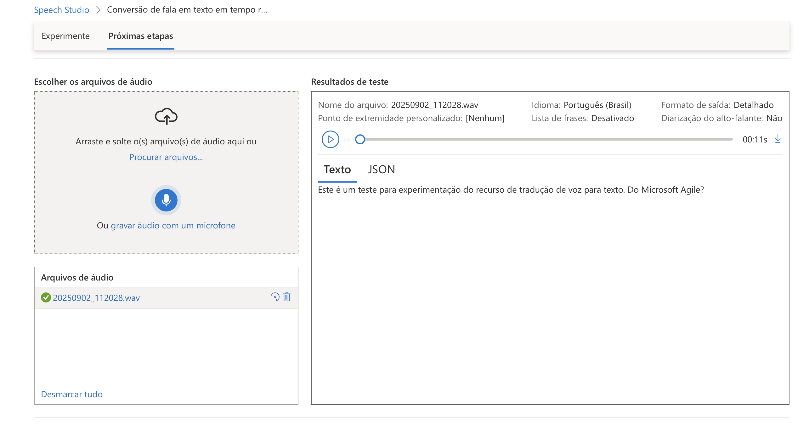
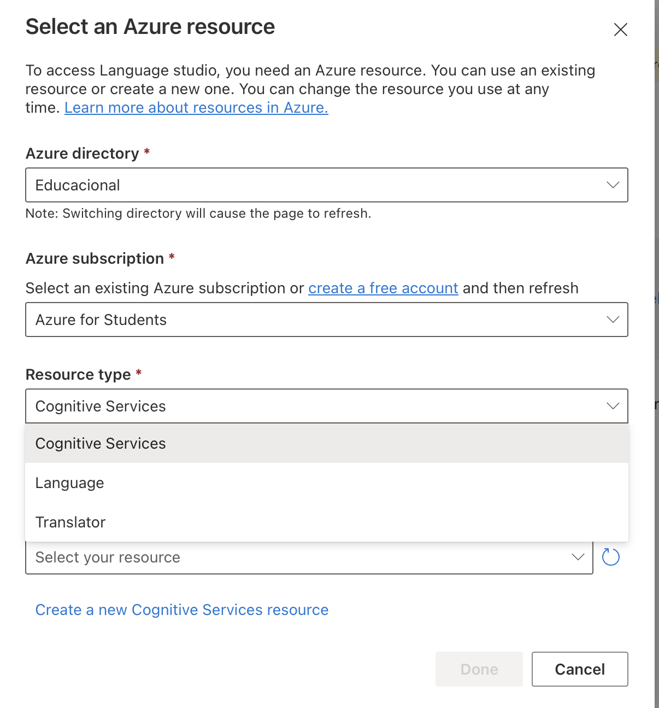
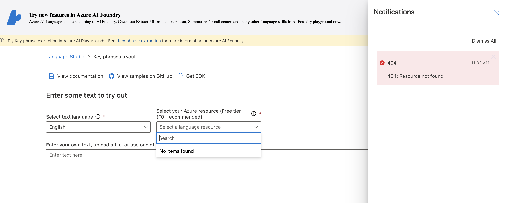
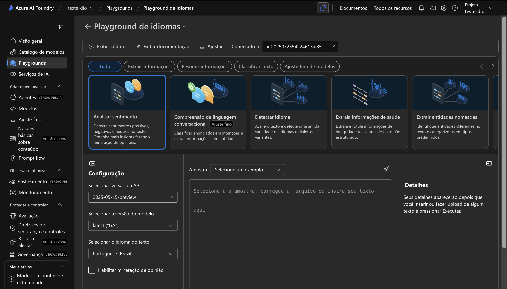
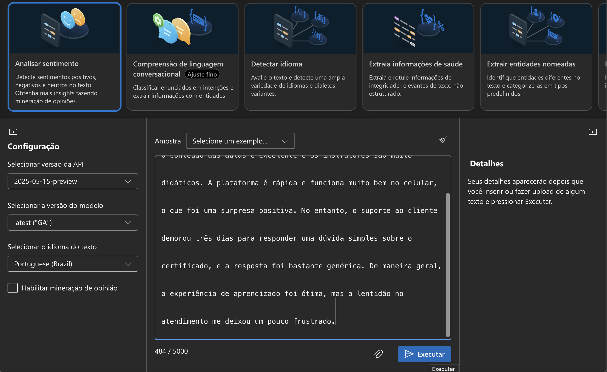
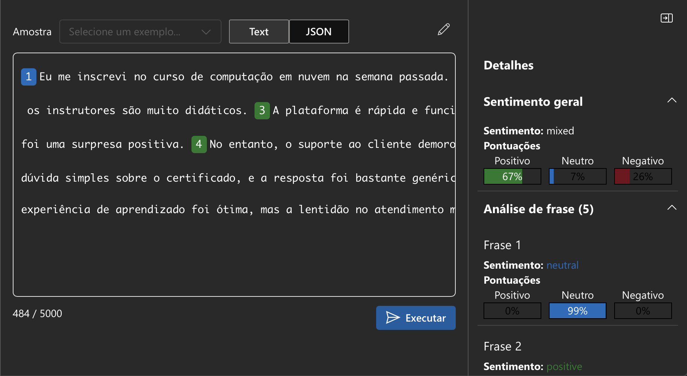

# Desafio DIO: Análise de Fala e Sentimento com Azure AI Services

## 📖 Descrição do Projeto

Este projeto documenta a execução de um desafio prático da plataforma DIO, focado em explorar as capacidades dos Serviços de Inteligência Artificial do Microsoft Azure. O objetivo foi utilizar o **Speech Studio** para conversão de fala em texto e uma ferramenta de análise de linguagem para identificar sentimentos em um texto.

A experiência abrange desde a criação do recurso de IA no portal do Azure até a execução de testes práticos, incluindo a superação de desafios técnicos relacionados ao ambiente da conta de estudante.

## 🤖 Ferramentas Utilizadas

* **Microsoft Azure** (com assinatura Azure for Students)
* **Azure AI Services** (Recurso multisserviço)
* **Azure Speech Studio**
* **Azure AI Studio** (Playground de Idiomas)

## 🚀 Passo a Passo da Experiência

A seguir, um detalhamento de todo o processo, desde a configuração inicial até os testes finais.

### 1. Criação do Recurso no Azure

O primeiro passo foi criar o recurso de Serviços de IA do Azure. Utilizando uma assinatura "Azure for Students", o recurso `bot-proj-dio` foi configurado na região `Brazil South` com o tier de preço `Standard S0`, conforme a disponibilidade da conta.

Após a implantação, o recurso foi exibido com sucesso no painel do Azure, pronto para ser utilizado.

### 2. Teste com Speech Studio

Com o recurso ativo, o primeiro teste foi realizado no Speech Studio para validar a funcionalidade de conversão de fala em texto. Foi feito o upload de um arquivo de áudio de exemplo, e a ferramenta transcreveu o conteúdo para texto com sucesso e rapidez, demonstrando a eficácia do serviço.

### 3. Desafio com o Language Studio

A etapa seguinte foi testar a análise de sentimento. A tentativa inicial foi conectar o Language Studio padrão ao recurso de IA criado. No entanto, o processo apresentou um erro "404, Resource not found", possivelmente relacionado a permissões específicas ou à forma como a assinatura de estudante se integra com este serviço em particular.

### 4. Solução: Teste no Azure AI Studio (Playground)

Para contornar o problema, a funcionalidade de análise de sentimento foi acessada através do **Playground de Idiomas do Azure AI Studio**, uma interface mais recente e integrada. Esta abordagem funcionou perfeitamente.

Foi selecionada a opção "Analisar sentimento" e um texto com uma mistura de sentimentos positivos, negativos e neutros foi inserido para o teste.

O resultado foi impressionante. A IA classificou o sentimento geral do parágrafo como **misto (mixed)** e forneceu uma análise detalhada para cada frase individualmente, identificando corretamente os trechos neutros, positivos e negativos com suas respectivas pontuações de confiança.

## ✔️ Conclusão e Aprendizados

Esta experiência foi extremamente valiosa para compreender o ecossistema de IA do Azure. Demonstrou a facilidade de uso do Speech Studio e, mais importante, revelou a necessidade de flexibilidade ao encontrar obstáculos. A utilização do Azure AI Studio como uma alternativa poderosa ao Language Studio tradicional foi um aprendizado chave.

O desafio foi concluído com sucesso, explorando com êxito ambas as funcionalidades de IA propostas e documentando uma solução eficaz para um problema comum em ambientes de teste específicos.
